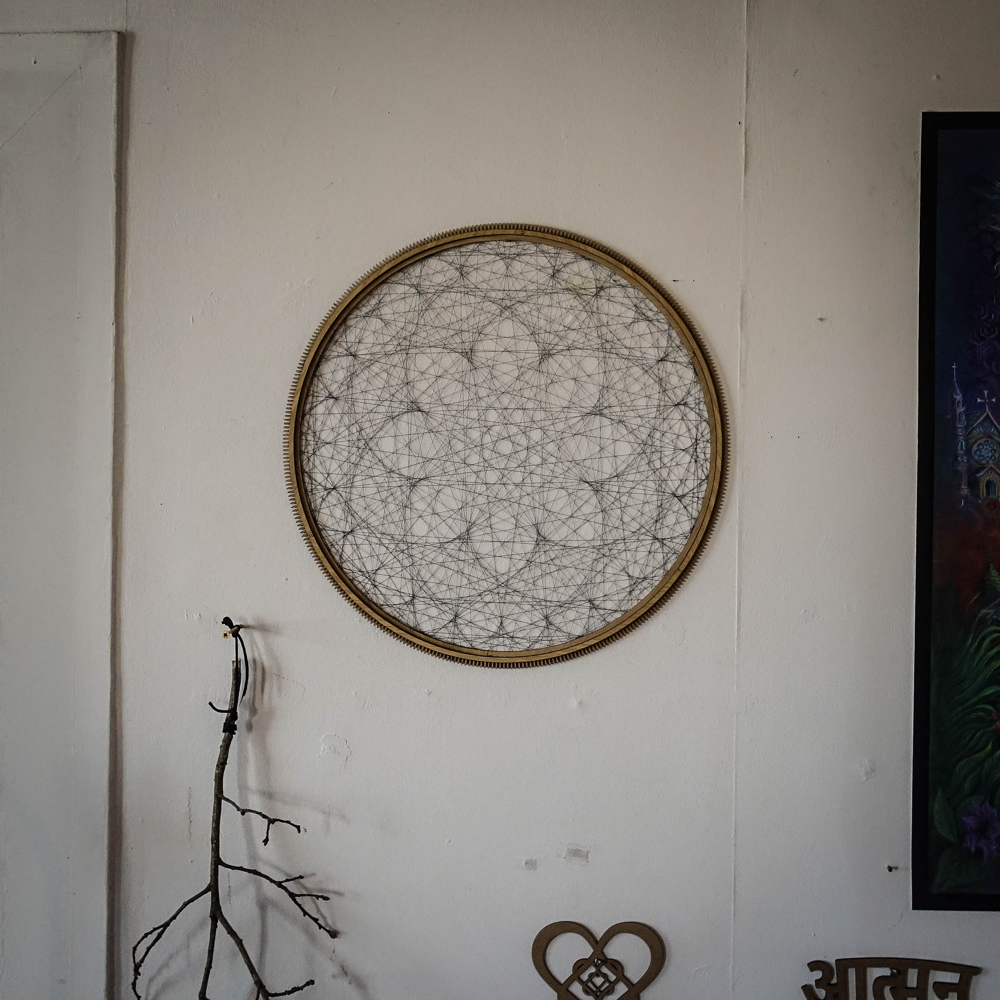

# Stringart Mandalamaker

 This machine is built to weave a string on a frame so that it creates a mandala pattern.
 See [Stringdala App](https://github.com/compsognathus123/Android-Stringdala/) for pattern creation.

 ## Images
 

   

  

